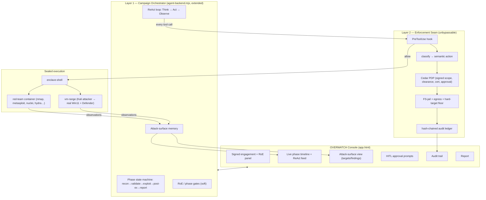

# Enclave OVERWATCH — Governed Autonomous Red-Team Campaigns

> **Working codename: OVERWATCH** (autonomous operation *under* governance). Alternatives: SENTINEL, VANGUARD, WARDEN. Rename freely.
>
> Status: **design** · Author: Enclave · Inspired-by (not forked): [RedAmon](https://github.com/samugit83/redamon)

---

## 0. North Star

**Long-term goal: a RedAmon-class autonomous offensive-security platform — near-identical in capability surface — built as part of Enclave, and materially better in quality.** Not a lite clone: the full thing (recon → exploit → post-ex → auto-remediation, attack-surface graph, parallel sub-agents, cross-session memory), reached via the roadmap in §9. Capability parity is *table stakes*; the quality gap is the moat.

"Better in quality" is specific — and it's exactly where Enclave wins:

- **Governance-grade trust.** RedAmon trusts its own agent to obey its RoE. Enclave *proves* it: every action is authorized server-side against a signed identity and written to a hash-chained ledger. The difference between "the agent shouldn't go out of scope" and "the agent *cannot*, and here is the cryptographic audit trail" is precisely what a regulated buyer (SOC 2 CC6/CC7, pentest firms, internal red teams) needs and RedAmon structurally cannot offer.
- **More autonomy, safely.** Because the box is cryptographic, the agent can run *more* unattended than RedAmon's — RedAmon needs app-level approval gates because it has no other way to bound the agent.
- **Polish.** The console shows the governance happening *live* (§6) — calmer, clearer, more reassuring than a raw agent dashboard.
- **Reliability.** Deny-as-signal re-planning, per-phase/campaign budgets, fail-closed everywhere — the loop degrades gracefully instead of running wild.

---

## 0.1 Locked requirements (non-negotiable — Jack, 2026-07-29)

1. **Better than RedAmon, always.** Ship **every feature they have, but better** — parity is the *floor*, superiority the target. "Why choose the worse option."
2. **Model-agnostic perfection.** The engine must run **flawlessly no matter which AI drives it** (Claude, Kimi, any capable model) — deterministic routing, fail-closed error handling, robust across models. The AI must *always work perfectly* in our version.
3. **As lenient as RedAmon, or MORE.** VARVEL imposes **no governance friction on the operator** — professionals do their work *easier* inside Enclave than in RedAmon. The strict, unbypassable enforcement is the **Enclave platform's** job underneath (a quiet net), never VARVEL UX friction.
4. **The graph / 3D attack-surface environment** (RedAmon's signature, shown on their GitHub) is required — and we go **true 3D** to exceed their 2D force-graph.
5. **Out-tool + out-quality** is the competitive axis; **governance comes free from the enclave** (see §0 North Star and [redamon-assessment.md](redamon-assessment.md)). VARVEL = the best autonomous red-team platform, that *also* happens to be governed.

---

## 1. What it is, in one line

**An autonomous red-team operator that runs a full engagement — recon → validate → exploit → post-ex → report — with the human out of the moment-to-moment loop, because the leash is a cryptographic signature the AI cannot touch, not the AI's own good behavior.**

This is the feature that makes Enclave more than "a governed chat with security tools." RedAmon proved the *autonomous pentest loop* is real and valuable. Enclave's edge is that RedAmon trusts its own agent to respect the Rules of Engagement; **Enclave enforces them server-side against a signed identity.** That difference is the whole product.

---

## 2. The core idea: two governance layers

Your instinct is right, and it's how RedAmon and every serious autonomous-ops system is built. There are **two layers**, with two **different trust models**:

| | **Layer 1 — Application (the agent)** | **Layer 2 — Enclave platform (the hook)** |
|---|---|---|
| Trust model | **Trust the AI.** Advisory / ergonomic. | **Trust nothing.** Unbypassable, server-side. |
| Lives in | The campaign orchestrator (`agent-backend.mjs`) | The PreToolUse hook → Cedar PDP → audit ledger |
| What it holds | Workflow: which phase next, how aggressive, stealth timing, when to ask for guidance, how to chain tools, the RoE *as intent* | The hard boundary: signed engagement scope, clearance/cert gates, FS-jail, egress deny-all, destructive-needs-approval, hard target blocks |
| If the AI ignores it | A worse assessment. Annoying, not dangerous. | **Impossible** — the AI never gets the capability; the hook denies against the signature. |
| Why here | Fast to build, flexible, great UX, lets the agent be smart | Because a signature can't be argued with, prompt-injected, or self-elevated |

### The one rule that keeps "trust the AI" safe

> **Anything catastrophic-if-ignored MUST live on Layer 2. Layer 1 is for workflow, UX, and soft policy only.**

Apply it as a checklist for every control:

| Control | Layer | Why |
|---|---|---|
| "Only touch in-scope targets" | **L2** | Catastrophic (hitting a third party) → must be enforced, not trusted. Already enforced: `ipInAnyScope(target, signed engagementScope)`. |
| "No destructive action without approval" | **L2** | Cedar already gates `exploit` on `ENCLAVE_APPROVAL`. |
| "Never read host creds / escape the workspace" | **L2** | The FS-jail we just shipped (`§4b/§4c` in the hook). |
| "Egress is deny-all except the research allowlist" | **L2** | Broker + `egress-allowlist.mjs`. |
| "Never target gov/mil/critical-infra" | **L2** (new hard floor) | Non-disableable, like RedAmon's. Even a valid signed scope can't opt in. |
| "Run recon before exploitation" | L1 | Workflow. A bad order = a worse report, not a breach. |
| "Use stealth timing / rate-limit scans" | L1 | Operational preference. |
| "Ask the operator when unsure" | L1 | UX. |
| "Prefer low-noise tools first" | L1 | Strategy. |

**Net:** the agent gets to be autonomous and clever inside a box whose walls are cryptographic. That's what lets us pull the human out of the loop without it becoming a loose cannon — and it's a guarantee RedAmon structurally cannot make.

---

## 3. Architecture



### Reuse map — how much already exists

| Component | Status |
|---|---|
| Sealed tool execution (`enclave-shell`) | ✅ built |
| Tool set (red-team image; vm-range Kali+Win11) | ✅ vm-range verified; red-team image defined, one `docker build` away |
| Hook → classify → **real Cedar 4.x PDP** → audit ledger | ✅ built + tested |
| Signed engagement scope + clearance/cert gates | ✅ built (`marcus.json` scoped to the range) |
| FS-jail (host-cred / workspace-escape denial) | ✅ shipped this week |
| Governed agent loop (`runGovernedAgent`) | ✅ built — **the base we extend into the campaign engine** |
| HITL for exploitation (Cedar `exploit` + `ENCLAVE_APPROVAL`) | ✅ built |
| **Campaign state machine + phase gates** | ⬜ new (the core of this feature) |
| **Attack-surface memory** | ⬜ new (start as a JSON/markdown store; graph later) |
| **OVERWATCH console UI** | ⬜ new |
| Hard target floor (gov/mil/critical-infra) | ⬜ new (small, high-value) |

We are building **the loop, the memory, the console, and one new hard guardrail** — on top of a governance substrate that's already real. That's why this is viable now, not a moonshot.

---

## 4. The autonomous campaign engine (Layer 1)

A **campaign** is one governed engagement run. It is a state machine over phases; each phase is a ReAct loop; every action is a governed tool call.

### 4.1 Phases (adapted from RedAmon's 3-phase model)

1. **Recon / Informational** — enumerate the signed scope: subdomain/host discovery, port/service scan, tech fingerprint, CVE enrichment. *Read-only-ish; fully autonomous.*
2. **Validate** — confirm findings are real: nuclei templates, version checks, safe PoBs (proof-of-behaviour), credential *spray disabled by default*. *Autonomous, but the boundary to destructive is near — see gates.*
3. **Exploit** — only reached through a **gate**. Actual exploitation / credential attacks / metasploit. *Always Layer-2 gated (`exploit` action → needs approval); default posture is HITL here.*
4. **Post-exploitation** — enumeration, priv-esc paths, persistence *mapping* (not planting). *Gated like exploit.*
5. **Report** — synthesize findings → severity-ranked report written to the workspace. *Autonomous.*

### 4.2 The ReAct loop (each phase)

```
loop until phase_objective_met OR budget_exhausted OR gate_hit:
    THINK   — query attack-surface memory + phase goal → choose next action
    ACT     — emit a tool call  ──►  [ Layer 2 hook decides allow/deny ]  ──► enclave-shell
    OBSERVE — parse tool output → update attack-surface memory → emit to UI feed
    CHECK   — phase gate? budget? operator chat steer? → continue / advance / pause
```

- **Budgets** (Layer 1): per-phase and per-campaign token + wall-clock + tool-invocation caps, so a run *paces itself and terminates gracefully* instead of running forever. (Mirrors the Task-Budgets idea.)
- **Deny is a signal, not a crash**: when Layer 2 denies an action, the agent receives the reason and re-plans within policy — exactly what the hook already returns.
- **Operator chat steer** (Layer 1): the human can drop a message mid-run ("skip the .50 subnet", "go noisier") and the agent folds it into THINK. Never widens Layer-2 scope.

### 4.3 Phase gates

A gate is a transition guarded by **both** layers:

- **Layer 1 gate** (soft): "recon coverage ≥ X% before validate", "no validate findings ⇒ skip exploit". Configurable RoE.
- **Layer 2 gate** (hard): the first `exploit`/destructive tool call in the exploit phase is denied unless `ENCLAVE_APPROVAL` is granted for this campaign — surfaced in the UI as an **approval card**. This is the one place a human *must* re-enter the loop by default, and even that is policy-configurable per engagement (some scopes may pre-authorize exploitation; the *signature* says so, not the agent).

### 4.4 Deferred (v2+), noted so we don't design them out

- **Governed sub-agents** (RedAmon's "Fireteam" fan-out) — parallel scoped investigations. Collides with our current *no-subagents seal*, so it needs its own governed spawner (a sub-agent inherits the parent's signed scope, never more). Big value, real work.
- **Background jobs** for long-running tools, streaming into the feed.
- **Auto-remediation** (RedAmon's CypherFix → PRs). Natural, but publishing/PRs are an egress action → must route through governed egress.
- **Cross-session memory** (RedAmon's EvoGraph) — campaigns learn across runs.

---

## 5. Attack-surface memory

The agent must query "what do I know about the target" before each decision. RedAmon uses Neo4j (17 node types). We **start simpler and earn the graph**:

- **v1:** a structured `surface.json` in the sealed workspace — `{ targets[], services[], findings[], credentials_refs[], actions[] }`, append-only, human-readable. The agent reads/writes it via the (jailed) file tools; it *is* the campaign's working memory and the source for the UI.
- **v2:** promote to a graph (Neo4j or an embedded graph) once the flat model strains — when relationships (host→service→cve→exploit-path) start driving decisions.

Everything in the store is scoped to the campaign + signed identity, and secrets are stored by reference/redacted (never raw creds in memory — matches RedAmon and our audit-redaction posture).

---

## 6. UI / UX — the "very nice, like RedAmon" part

The OVERWATCH console is a **new full-screen mode** in `app.html` (you enter it from a scoped red-team/vm-range enclave). Enclave's existing visual language — dark, `◈`, clearance chips, the mono audit feel — carries over. Target aesthetic: **calm command-center, not a noisy hacker dashboard.**

### Layout (three columns + header)

```
┌─────────────────────────────────────────────────────────────────────────────┐
│  ◈ OVERWATCH · pentest-northwind    ● LIVE   scope 10.10.0.0/16 · L4 Marcus   │  header: identity + SIGNED scope, always visible
├───────────────┬──────────────────────────────────────┬──────────────────────┤
│ PHASE RAIL    │  ACTION FEED (the ReAct stream)       │  ATTACK SURFACE       │
│               │                                        │                      │
│ ● Recon    ✓  │  ◈ think  "3 live hosts, .130 runs…"  │  ▸ 10.10.5.20        │
│ ● Validate ▶  │  ⚡ act   nmap -sV 10.10.5.20          │     :80 http nginx   │
│ ○ Exploit  🔒 │  ✓ obs   6 ports, Defender filtering  │     :445 smb         │
│ ○ Post-ex  🔒 │  ◈ think  "validate the SMB finding"  │     ⚠ CVE-…  high    │
│ ○ Report      │  ⛔ deny  scan 8.8.8.8 — OUT OF SCOPE │  ▸ 10.10.5.21        │
│               │  ◈ think  "re-plan within scope"      │     (enumerating…)   │
│ ── budget ──  │  …live…                                │                      │
│ ▓▓▓▓░ 62%     │                                        │  findings: 4 (1 hi)  │
├───────────────┴──────────────────────────────────────┴──────────────────────┤
│  AUDIT · hash-chained · 0 policy violations · every action ↑ decided here     │  footer: the ledger, live
└───────────────────────────────────────────────────────────────────────────────┘
```

### Key UI elements

- **Header — signed scope, always on screen.** The engagement scope + operator identity are pinned so it's unmistakable *what the leash is*. Clicking it shows the signed token summary (not the secret). This is the visual embodiment of "the boundary is cryptographic."
- **Phase rail** — the campaign state machine as a vertical stepper. `✓` done, `▶` active, `🔒` gated (needs approval), `○` pending. A live budget bar underneath.
- **Action feed** — the ReAct stream, the heart of the screen. Three glyphs: `◈ think` (agent reasoning, dimmed), `⚡ act` (tool call, mono), `✓/⛔ obs` (result — and crucially, **denials render inline in red with the policy reason**). Watching a `⛔ deny scan 8.8.8.8 — OUT OF SCOPE` scroll by *is the demo*: the audience sees the platform stop the AI in real time.
- **Attack-surface panel** — the live target map: hosts → services → findings, severity-colored. In v2 this becomes an interactive graph.
- **Approval card** — when a Layer-2 gate hits (exploit), a modal slides in: *"Campaign wants to run `exploit X` against 10.10.5.20 (in scope). This is destructive. Approve / Deny / Approve-phase."* Approving sets `ENCLAVE_APPROVAL` for that scoped action. This is HITL made pleasant, not paperwork.
- **Audit footer** — the hash-chained ledger, live, with a running "0 policy violations" (or a count) — the trust indicator.
- **Report view** — on Report phase, a clean severity-ranked findings document (rendered from `surface.json`), exportable.
- **Controls** — `▶ Run` / `⏸ Pause` / `⏹ Stop` / `↯ Steer` (drop a chat nudge). Pause/Stop always available; Stop tears down the ephemeral VM.

### The visual thesis

RedAmon's UI shows an autonomous agent working. **OVERWATCH's UI shows an autonomous agent working *and the platform governing it in real time*** — the denials, the signed-scope header, the live audit chain. The governance isn't hidden; it's the most reassuring thing on screen. That's the demo that sells Enclave.

---

## 7. Data model (v1)

```
Campaign   { id, engagement (signed session ref), scope, phases[], status, budget, created }
Phase      { name, status, objective, gates[], started, ended }
Action     { id, phase, think, tool, args, decision (allow|deny), reason, observation, ts }   // 1:1 with an audit-ledger entry
Finding    { id, target, service, type, severity, evidence_ref, validated, ts }
Target     { ip, hostname?, services[], findings[], in_scope (derived, L2-authoritative) }
Approval   { action_id, requested, decided_by, decision, ts }
```

`Action.decision`/`reason` come **from the hook**, not the agent — the UI shows the platform's verdict, so the agent can never misreport that something was allowed.

---

## 8. Safety, authorization & boundaries

- **Authorized-only by construction.** A campaign can only act inside a **signed engagement scope**. The operator signs that scope out-of-band, and signs it *only for engagements they are legally authorized to test*. The agent cannot widen it; the platform enforces it. This is what makes autonomous offense legitimate rather than a weapon.
- **New hard floor (non-disableable):** gov/mil/intergovernmental/critical-infrastructure targets are denied at Layer 2 regardless of any signed scope — matching RedAmon's non-negotiable block. A scope that overlaps such ranges is refused.
- **HITL where it matters:** exploitation/destructive is Layer-2 gated by default. "No humans heavily in the loop" means *the human sets scope once and approves the destructive moments* — not *the human is removed from consequential decisions.*
- **Audit non-repudiation:** every action is a hash-chained ledger entry; the UI's "0 violations" is derived from it. (Backlog: sign ledger segments off-box — tracked in the hardening backlog.)
- **My build boundary (explicit):** this feature is **governed orchestration of existing tools** — the campaign loop, the memory, the console, the governance binding. It does **not** develop offensive internals (exploit development, evasion, anti-detection). Those live in the tools; improving them is out of scope for this work and routed elsewhere. OVERWATCH makes autonomy *governed*, not offense *better*.

---

## 9. Build roadmap

Each milestone is demoable on its own and reuses the prior.

| Phase | Deliverable | New work | Reuses |
|---|---|---|---|
| **P1 — Loop skeleton** | Autonomous **recon + validate** against the vm-range, findings → `surface.json`, live in a first-cut console. Exploit gate stops it. | Campaign FSM + ReAct controller on `runGovernedAgent`; `surface.json` store; minimal console (phase rail + action feed). | enclave-shell, hook, Cedar, vm-range, signed scope. |
| **P2 — HITL + report** | Approval card for the exploit gate; end-of-run report view; budgets + pause/stop. | Approval UX ↔ `ENCLAVE_APPROVAL`; report renderer; budget controller. | P1 + Cedar `exploit` gate. |
| **P3 — Hard floor + polish** | gov/mil/critical-infra hard block; the "very nice" console (attack-surface panel, audit footer, styling). | New Cedar policy + classify rule; full UI build. | P1–P2. |
| **P4 — Memory graph** | Promote `surface.json` → graph; cross-decision querying. | Graph store + query layer. | P1–P3. |
| **P5 — Fireteam + jobs** | Governed sub-agents (scope-inheriting) + background jobs. | Governed spawner; job runner. | all. |
| **P6 — Auto-remediation** | Findings → fixes → governed egress PRs. | CodeFix agent + governed publish. | all. |

**P1–P3 is the flagship.** P4+ are the "RedAmon-scale" expansions once the governed core is proven.

---

## 10. Open decisions for Jack

1. **Name** — OVERWATCH / SENTINEL / VANGUARD / something of yours?
2. **Default posture** — recon+validate fully auto with exploitation *always* HITL (safest demo), or let the signed scope pre-authorize exploitation per engagement?
3. **First target** — build P1 against the **vm-range** (real Win11, verified) or the lightweight **red-team Docker range** (needs the `enclave-redteam` image built ~10GB)? I'd start on vm-range since it's live.
4. **Engine base** — extend the **`agent-backend.mjs` governed loop** (real multi-tool loop; my recommendation) vs. the Claude-CLI path (single-shot-ish).
5. **Console** — new full-screen mode in `app.html`, or a dedicated page? (Lean: a mode toggle in the existing app so it shares auth/session.)
