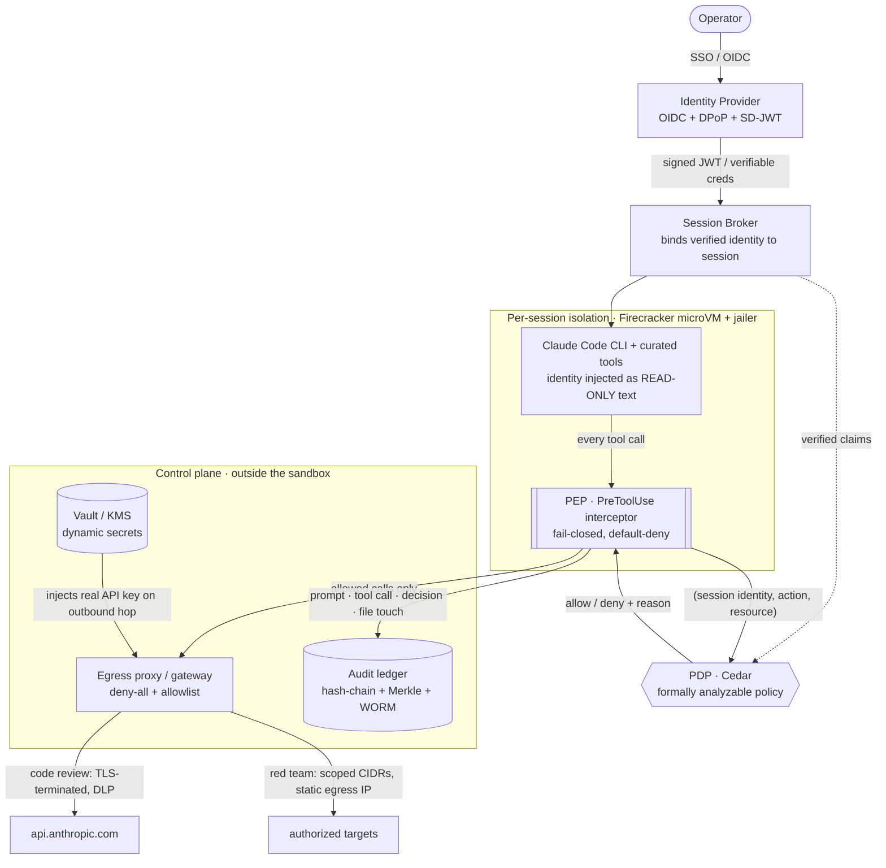

# Enclave — Security Architecture

> **Status:** Draft v0.1 · 2026-07-20 · design intent, not yet built
> **Scope:** the backend that makes Enclave a *sandbox*, not just a UI — isolation, identity, authorization, egress, secrets, and audit — serving two workloads (secure code review, red team ops) on one substrate.
> **Audience:** engineers building Enclave, and security/compliance reviewers evaluating it.

The [prototype](../README.md) demonstrates the product experience and the identity model. **This document describes the hardened backend that has to exist for the product to be real.** It is the ~90% of the work that isn't visible in the UI.

---

## 1. Design principles (the non-negotiables)

1. **Authorization lives below the model, never in it.** A user's role / clearance / license *informs* the AI (what to surface, how to phrase). It never *authorizes* it. Every privileged action is checked, server-side, against a **cryptographically bound session identity** — not against anything the model emitted. If prompt injection makes Claude *say* "I am cleared for this," the enforcement point ignores the string and looks up the signed identity bound to the session.
2. **Assume prompt injection succeeds.** Any agent that reads untrusted content (code, a target's HTTP responses, a pcap) can be steered. We treat the model as *potentially adversarial to its own operator* and put the real controls in the infrastructure around it. Network + policy controls are the backstop for when — not if — the model is tricked.
3. **Isolation is a hardware boundary, not a process boundary.** Multi-tenant untrusted code gets a VM per session. A container alone is one kernel bug away from host root.
4. **Ephemeral by default.** Every session is a disposable, byte-identical-clean environment that is *destroyed*, not cleaned, at teardown. Nothing survives or crosses tenants.
5. **Default-deny egress.** Data leaves only through an audited path. The sandbox cannot reach an arbitrary host even if fully compromised.
6. **Everything is auditable and tamper-evident.** Every prompt, tool call, decision, and file touch lands in an append-only ledger that an auditor — or a customer — can verify without trusting us.
7. **One substrate, shaped by policy.** Code review and red team ops are the *same* runtime with different policy objects (guest capabilities, network shape, egress ACL) resolved at session creation. We do not build two stacks.

---

## 2. Threat model

**Assets:** customers' proprietary source code; red-team engagement data & findings; the audit ledger; Anthropic/API keys; cross-tenant confidentiality.

**Adversaries & threats we design against:**

| # | Threat | Primary control |
|---|---|---|
| T1 | Malicious/injected code escapes the sandbox to the host | Hardware-virtualized microVM + jailer + inner hardened container |
| T2 | One tenant reaches another's data | VM-per-session, no shared writable mounts, workspace-scoped authz |
| T3 | Prompt injection → data exfiltration | Default-deny egress; code-review path has *no NIC*; DLP on the only exit |
| T4 | The model self-escalates privileges | Out-of-model reference monitor keyed on signed identity, not model output |
| T5 | Theft of the Claude/API key | Key never enters the sandbox; injected at an egress proxy outside the VM |
| T6 | Audit tampering (incl. by an insider with infra access) | Hash-chained + Merkle WORM ledger, externally anchored |
| T7 | Red-team traffic hits an out-of-scope target | L3/L4 egress locked to the signed engagement scope; static egress IP |
| T8 | Stolen session token replayed elsewhere | Short-lived, sender-constrained (DPoP/mTLS) tokens |

**Explicit non-goals (v1):** defending a determined *malicious operator* who is themselves authorized for the action (that's an HR/legal control, though the ledger deters it); nation-state hypervisor 0-day; covert-channel timing attacks between microVMs.

---

## 3. System overview

Every session runs the agent **inside** an isolation boundary. Identity flows two ways that never cross: as *untrusted informational text* into the model, and as a *verified token* into the policy layer out-of-band. Enforcement happens at a **Policy Enforcement Point (PEP)** that sits between the agent's tool-call emission and the tool actually running — outside the agent's address space.



The seam that makes it one architecture: a **policy engine turns `(workload_class, signed_scope)` into `(VMM flags, guest capability set, network attachment, egress ACL, proxy config)`**. Everything below that seam is identical for both workloads.

---

## 4. Layer 1 — Identity (signed & verifiable)

- **SSO via OIDC on OAuth 2.1.** Okta/Auth0/Entra, or self-hosted **Keycloak** where full control of the claim pipeline / on-prem is required (cleared environments).
- **Short-lived access tokens (5–15 min)**, refresh out-of-band. Never long-lived bearer tokens inside the sandbox.
- **Sender-constrained tokens** so a leaked token can't be replayed: **DPoP (RFC 9449)** binds the token to a client-held key, or **mTLS-bound tokens (RFC 8705)**. *(T8)*
- **Role/team/clearance as namespaced claims** (`https://enclave/role`, `/clearance`, …).
- **Licenses & clearance as verifiable credentials** using **SD-JWT (RFC 9901)** for *selective disclosure* — prove "clearance ≥ Secret" or "holds OSCP" without dumping every attribute, and accept credentials issued by a different authority (a cert body, a clearance authority) via **OpenID4VCI**.
- **Workload identity for the sandbox itself** via **SPIFFE/SPIRE**: each session VM gets a short-lived **X.509-SVID** used for mTLS to the broker/PDP/proxy — no static service keys between components.

**The split that enforces Principle 1:**

| Path | Consumer | Trust |
|---|---|---|
| Identity rendered into the model's context | Claude (to tailor behavior) | **Untrusted** — treated exactly like tool output: data, not authority |
| Verified token validated against IdP JWKS, stamped onto the server-side session | The PDP/PEP | **Trusted** — the only identity that gates actions |

The two paths never meet. The model's copy of the identity is decorative.

---

## 5. Layer 2 — Authorization (the reference monitor)

**PEP = a mandatory interceptor between the agent's tool-call emission and execution**, outside the agent's address space, so the agent's own code cannot bypass it. Default-deny, fail-closed, logs every decision.

**PDP = Cedar.** Chosen over OPA/Rego and Oso specifically because Cedar policies are **deterministic, strongly typed, and formally analyzable** — we can *prove* that no policy grants a red-team destructive action to an under-cleared principal. For a clearance system that's the deciding property, not a nicety. Cedar's sub-millisecond evaluation also matters because we evaluate on *every* tool call. *(Use OPA only if policies must fetch live external data mid-decision; Oso is optimized for in-app ReBAC, not an external reference monitor.)*

**Modeling:**
- `clearance` as an ordered principal attribute, `classification` on the workspace/resource: `permit(...) when { principal.clearance >= resource.classification }`.
- **Workspace scoping** defeats confused-deputy: `permit` only when `resource.workspace == context.session.workspace`.
- **Red-team destructive/exploit tools** gate on clearance **and** a signed engagement-scope claim **and** — for the highest-risk actions — **human-in-the-loop approval**: the PEP blocks and raises an approval request instead of executing.
- **MCP tools** hardened per the current MCP auth track: OAuth 2.1 + PKCE, Resource Indicators (RFC 8707) to stop token pass-through/confused-deputy, per-tool scopes. The MCP server never accepts the model's asserted identity.

---

## 6. Layer 3 — Isolated runtime

**Primary substrate: Firecracker microVMs**, one per session, behind the **jailer**, restored from a snapshot. A real guest kernel means all offensive tooling works unmodified — which is what lets one runtime serve both workloads.

| Runtime | Boundary | Cold start | Runs offensive tooling? | Verdict |
|---|---|---|---|---|
| **Firecracker microVM** | Hardware (KVM). Escape needs a hypervisor CVE (six-figure-bounty class). ~83K-LOC Rust VMM, no device emulation → tiny surface | <125 ms boot; **~28 ms from snapshot** | **Yes** — raw sockets, nmap, C2 all native | **PRIMARY, both workloads** |
| **Kata Containers** | Hardware VM, K8s-native via `RuntimeClass`; QEMU backend for device/GPU/nested-VM passthrough | ~120–480 ms | Yes | **Secondary** — K8s ergonomics, or engagements needing passthrough/Windows |
| **gVisor (runsc)** | Userspace kernel (software boundary) | ~50 ms | **No** — raw sockets off/incomplete; many pentest tools break; heavy file-I/O 10–200× slower | **Code-review density option only. Never red team.** |
| **Plain OCI container** | Shared host kernel, 450+ syscall surface; recent escapes (Leaky Vessels, runc CVE-2025-31133) | sub-second | Yes, but no tenant boundary | **Never the sole boundary** — use as the *inner* wall |
| **Full VM (QEMU)** | Hardware, large device surface | seconds | Yes, incl. nested virt/Windows | **Reserve** for special engagements |

**Defense in depth:** inside each microVM, still run the agent in a hardened container — `--cap-drop ALL` (then add back only what the workload needs), seccomp, read-only root + `tmpfs` scratch, non-root uid, pid/memory/cpu caps — so even a guest-kernel compromise hits a second wall before the VMM.

**Ephemerality (T2):**
- **Golden-snapshot boot:** one warm base image per workload class, snapshotted; each session is a *restore* (~28 ms). COW memory-mapping shares clean pages across VMs (density) while writes go to per-VM COW pages (isolation). Every session starts byte-identical-clean.
- **Per-session ephemeral disk:** overlay/thin-snapshot over a read-only base; code-review writable layer sits on a **dm-crypt volume keyed by a random per-session key discarded at teardown** → post-wipe data is cryptographically unrecoverable. Scratch = `tmpfs`.
- **Teardown = destroy:** kill the VMM, unlink the COW + ephemeral disk, drop the dm-crypt key, release tap/veth + egress-IP lease, delete namespace/cgroup. Never reuse a rootfs across tenants.
- **Snapshot hygiene:** restoring clones RNG state, MAC, vsock ports → **reseed guest RNG on resume, randomize guest identity, bake no secrets into the golden image.**

---

## 7. Layer 4 — Egress firewall

Layered, all default-deny, **none of it enforced in-app**.

**Code-review path — near-zero egress (source code is present → highest exfil risk):**
- **Layer 0: no external NIC at all.** All traffic exits over **vsock → a host-side proxy**. Default-deny becomes *physical*: there is literally no route out except the proxy, even under full compromise. *(This is Anthropic's recommended pattern.)*
- **TLS-terminating proxy** (Envoy/mitmproxy) with a CA in the guest trust store → inspect *request bodies* and DLP-scan for exfil (base64'd keys, source snippets), not just SNI. SNI-only allowlisting is defeatable by domain fronting.
- **Allowlist = exactly `{api.anthropic.com, case-ledger host}`** and nothing else. DNS limited to those names via a controlled resolver.

**Red-team path — scoped raw access (the hard case):**
- Offensive tools need **raw sockets + arbitrary ports** — you can't push a SYN scan through an HTTP proxy. So the no-NIC trick doesn't apply; enforce at **L3/L4** instead.
- VM gets a **real tap NIC** with `NET_RAW`/`NET_ADMIN` in-guest, but **default-deny egress; allowlist = only the engagement's signed, authorized CIDRs**, enforced with nftables/eBPF/Cilium `toCIDR` on the host — outside the tenant's control. Off-scope drops are alerted. *(T7)*
- Route through a **Cilium Egress Gateway** that SNATs to a **static, pre-agreed egress IP** the target org whitelisted (deconfliction + proves in-scope).
- **Split control-plane from attack-plane:** the model's own Claude API calls and case-ledger pushes go through the **same locked TLS-terminating proxy as code review**; only *target-scope* traffic uses the raw NIC.

**The crux — permit offensive traffic without permitting exfil:** separate the **attack surface** (scoped target CIDRs, raw, no data sink there) from the **data sink** (Claude API + ledger, proxied + DLP'd). Proprietary data can only leave via the audited proxy; the raw path can only reach authorized targets. The un-inspectable raw path gets compensating controls: **volumetric/rate caps, full flow logging (Cilium Hubble), time-boxed scope leases, anomaly alerting.**

**Always add an explicit DNS allow rule** — every FQDN policy silently fails without one, and it shuts down DNS-tunnel exfil.

---

## 8. Layer 5 — Secrets

**The sandbox never possesses a usable long-lived secret.** *(T5)*

- **HashiCorp Vault** (or cloud KMS) backbone; prefer **dynamic secrets** (don't exist until read, TTL-leased, auto-revocable — instant kill on any exfil alert).
- Sandbox authenticates to the broker with its **SPIFFE SVID**, not a static token. No secret is ever mounted into the guest, in an env var the shell tool can read, or in the context window.

**Bring-your-own Claude key without exfiltration:**
1. The user's Anthropic key is stored **encrypted in Vault**, never handed to the session.
2. The guest's Claude CLI points at an in-VPC **broker proxy** via `ANTHROPIC_BASE_URL`; the CLI holds only a short-lived token to *that proxy*.
3. The **broker fetches the real key from Vault at call time and injects the `Authorization` header on the outbound hop to `api.anthropic.com`** — outside the sandbox.
4. Egress is locked so the sandbox can reach *only* the broker. **This pattern is only as strong as that egress lock — if the guest has any unfiltered outbound path, the injection proxy is moot.**

*Stronger where the provider API allows:* mint **per-session, short-lived API keys** (Vault dynamic-secrets style, `ttl=1h`) via the Admin API so the root key is never exposed at all.

---

## 9. Layer 6 — Audit ledger

Two layers, both required. *(T6)*

1. **Storage immutability (external attacker):** every event to **WORM object storage — S3 Object Lock in *compliance* mode** (blocks deletion/overwrite even by root for the retention period) or Azure immutable blob. This is the artifact auditors accept for SOC 2 CC7.3.
2. **Cryptographic integrity (insider with infra access):** **hash-chain** every entry (`SHA-256(prev_entry)` embedded → any edit breaks the chain), batch under a **Merkle tree**, and periodically **anchor the Merkle root externally** (a transparency log — Google **Trillian** / Sigstore **Rekor**, RFC 6962 pattern — plus RFC 3161 timestamps) so tampering is provable *by any party without trusting Enclave*. Sign each segment with a KMS-held key.

**Do not build on AWS QLDB** — support ended 2025-07-31 and the migration path loses verifiability. Turnkey alternatives: Azure SQL Ledger, immudb, Dolt; but hash-chain + Merkle + WORM + Trillian/Rekor is cloud-neutral and gives the external-verifiability story the others can't.

**Event schema (SOC2/ISO-exportable):**
```json
{ "ts": "...", "session_id": "...", "verified_principal": "...", "clearance": "L3",
  "workspace": "...", "event_type": "prompt|tool_call|file_touch|decision",
  "action": "...", "resource": "...", "pdp_decision": "allow|deny",
  "policy_version": "...", "prev_hash": "...", "segment_sig": "..." }
```

---

## 10. Embedding Claude Code safely

Claude Code is designed to be driven headless and constrained from *outside* the model — the mechanisms line up with this architecture (see Anthropic's **"Securely deploying AI agents"** guide). Exact flag/field names track the current docs; the *mechanisms* are:

1. **Headless / non-interactive** (`claude -p`, JSON / streaming output) driven by the session broker; capture `session_id`, cost, and every event.
2. **Managed settings with non-overridable `deny` rules** — delivered per session, locked so neither the user nor the model can widen them. Deny-by-default; allow only the curated tool set. A denied tool is removed from the model's context entirely.
3. **`PreToolUse` hooks are the wire to our PEP:** each hook fires *before* a tool runs, receives the tool name + inputs, and returns an allow/deny/defer decision — so we forward every call to the Cedar PDP over HTTP/mTLS and enforce the verdict. This is exactly the reference-monitor seam from §5. `PostToolUse`/`SessionEnd` hooks stream to the audit ledger.
4. **OS-level sandboxing** (filesystem scoped to the working dir, network restricted) as a layer *independent of* the permission system — defense in depth inside the microVM.
5. **Curated MCP tool shelf** exposes only vetted tools; default tools are denied unless explicitly needed.

The load-bearing idea: **the hook/policy layer is server-controlled and non-bypassable; the model's permissions are the floor, the PEP is the gate, the microVM + egress are the walls.**

---

## 11. One architecture, two workloads

| Dimension | Secure code review | Red team ops |
|---|---|---|
| Runtime | Firecracker (gVisor OK as density option) | Firecracker/Kata — **real kernel; never gVisor** |
| Guest caps | drop `NET_RAW`/`NET_ADMIN` | grant `NET_RAW`/`NET_ADMIN` in-guest |
| NIC | **none** — vsock → host proxy | real tap NIC on a scoped egress path |
| Egress default | deny-all | deny-all |
| Allowlist | `api.anthropic.com` + ledger; FQDN, **TLS-terminated, DLP-scanned** | signed engagement **CIDRs (L3/L4)** via egress gateway static IP; API/results via the same control-plane proxy |
| Primary data risk | proprietary **source present** → zero raw egress | source absent → risk is **tunneling out via a target** |
| Extra controls | — | HITL approval, volumetric caps, flow logs, time-boxed scope leases |

Same substrate, same control plane. Only the policy object differs.

---

## 12. Compliance mapping

| Enclave control | SOC 2 (TSC) | ISO 27001:2022 |
|---|---|---|
| SSO/OIDC, MFA, short-lived + sender-constrained tokens | CC6.1–CC6.3 | A.5.15, A.5.17, A.8.5 |
| Clearance→scope, workspace isolation, least privilege, HITL | CC6.1–CC6.3, CC5.2 | A.5.15, A.8.2, A.8.3, A.8.18 |
| Cedar PDP+PEP reference monitor (out-of-model enforcement) | CC6.1, CC5.1–CC5.2 | A.8.3, A.8.4, A.5.15 |
| Hash-chained WORM ledger, external anchoring | CC7.2–CC7.3, CC4.1 | A.8.15, A.8.16, A.5.28 |
| Vault/KMS, dynamic secrets, egress key-broker | CC6.1, CC6.7 | A.8.24, A.8.12 |
| Per-session microVM isolation, SPIFFE identity, egress filtering | CC6.1, CC6.6, CC7.1 | A.8.20, A.8.22, A.8.23, A.8.31 |
| Change management (`policy_version` in audit) | CC8.1 | A.8.32 |

CC6 (access) and CC7 (monitoring) are the two most-tested areas and the most common source of qualified reports — this architecture front-loads exactly those. ~70% control overlap between SOC 2 and ISO 27001: **build once, certify twice.**

---

## 13. Hard problems & honest risks

- **Firecracker needs KVM.** That means bare-metal (`.metal`) hosts, the newer nested-virt EC2 families, or PVM — the biggest infra cost/constraint. No nested KVM *inside* a guest; engagements needing their own VMs route to Kata/QEMU or bare metal.
- **The red-team raw path can't be content-inspected** like the code-review path. It is defended by scope + static egress IP + volumetric caps + full flow logging + short leases — compensating, not equivalent. This is the riskiest surface and the reason red team is Phase 3, not Phase 1.
- **TLS-termination friction:** needs a CA in the guest trust store; some tools pin certs or ignore `HTTP_PROXY`. Transparent `iptables REDIRECT` / proxychains as backstop.
- **Prompt injection is the trigger threat,** not an edge case — the whole network/policy layer exists because the model *will* eventually be steered. "Lethal trifecta" (private data + untrusted content + egress) is present by construction in code review; the no-NIC design is what neutralizes it.
- **Snapshot secret/RNG hygiene** — easy to leak identity across restored clones if you skip the reseed.

---

## 14. Phased build roadmap

- **Phase 0 — Prototype _(done)_:** product experience + identity model (this repo).
- **Phase 1 — Code-review MVP:** Firecracker + jailer, no-NIC + vsock + TLS-terminating proxy, Cedar PEP via `PreToolUse` hook, BYO-key broker, basic hash-chain audit. **This is the shippable "land" product.**
- **Phase 2 — Hardened & certifiable:** WORM + Merkle + external anchoring, SD-JWT clearances, SPIFFE/SPIRE, DPoP, DLP on egress, SOC 2 / ISO 27001 evidence pipeline.
- **Phase 3 — Red-team expansion:** raw scoped egress + Cilium Egress Gateway + static egress IP, signed engagement scoping, HITL approval flow, flow logging & anomaly alerting. **The "expand" product, on the same substrate.**

The sequencing mirrors the go-to-market: **code review lands** (lower risk, trivial egress, broad market), **red team expands** (higher value, harder egress, needs the hardened base proven first).

---

## References

**AI-agent deployment & isolation**
- Anthropic — [Securely deploying AI agents](https://code.claude.com/docs/en/agent-sdk/secure-deployment) (vsock/no-NIC + host-proxy, credential injection, gVisor overhead, hardened container config)
- Claude Code — [Headless mode](https://code.claude.com/docs/en/headless), [Permission modes](https://code.claude.com/docs/en/permission-modes), [Permissions](https://code.claude.com/docs/en/permissions), [Hooks](https://code.claude.com/docs/en/hooks), [Sandboxing](https://code.claude.com/docs/en/sandboxing)
- [Firecracker (NSDI'20)](https://firecracker-microvm.github.io/) · [Snapshot support](https://github.com/firecracker-microvm/firecracker/blob/main/docs/snapshotting/snapshot-support.md) · ["Your Container Is Not a Sandbox: MicroVM Isolation in 2026"](https://emirb.github.io/blog/microvm-2026/)
- [gVisor networking security](https://gvisor.dev/blog/2020/04/02/gvisor-networking-security/) · [Kata hypervisors](https://github.com/kata-containers/kata-containers/blob/main/docs/hypervisors.md)

**Identity, authz, secrets**
- [DPoP (RFC 9449)](https://workos.com/blog/dpop-rfc-9449-explained) · [OID4VCI / SD-JWT](https://www.authlete.com/developers/oid4vci/) · [SPIFFE/SPIRE](https://spiffe.io/docs/latest/spire-about/spire-concepts/)
- [Benchmarking policy languages: Rego vs Cedar vs OpenFGA (Teleport)](https://goteleport.com/blog/benchmarking-policy-languages/) · [OPA vs Cedar (Permit.io)](https://www.permit.io/blog/opa-vs-cedar)
- [Progent: privilege control for AI agents (arXiv 2504.11703)](https://arxiv.org/pdf/2504.11703)
- [Vault dynamic secrets for API keys](https://www.hashicorp.com/en/blog/managing-openai-api-keys-with-hashicorp-vault-s-dynamic-secrets-plugin)

**Audit & egress**
- [Merkle hash-chain audit logs](https://dipankar-das.com/blog/merkle-hash-chain-audit-logs/) · [AI audit-log immutability / WORM](https://www.deepinspect.ai/blog/ai-audit-log-immutability) · [AWS discontinues QLDB](https://www.infoq.com/news/2024/07/aws-kill-qldb/)
- [Cilium DNS-based egress](https://oneuptime.com/blog/post/2026-03-13-build-dns-based-egress-policies-cilium/view) · [Cilium Egress Gateway](https://docs.cilium.io/en/stable/network/egress-gateway/egress-gateway/)

**Compliance**
- [SOC 2 CC6 & CC7 controls](https://soc2auditors.org/insights/soc-2-security-controls/) · [SOC 2 vs ISO 27001 shared controls](https://truvocyber.com/blog/soc-2-vs.-iso-27001-key-differences-shared-efficiencies)

---

*This is a living design document. Flag/API specifics for Claude Code should be verified against the current official docs at build time; the architecture (isolation, out-of-model enforcement, default-deny egress, tamper-evident audit) is stable.*
